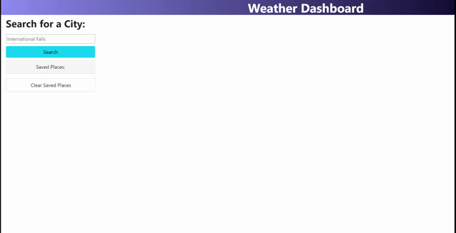

# Weather

## Description

I wanted to make a weather site that shows weather for the chosen city and saves your viewed locations for later. I learned a lot about API calls, and got more experience using jquery and local storage while making this page.

## Credits

Thanks to Instructor Gary for the starter code to parse out the five day forecast from the weather data.

## Links

https://strongjaw15.github.io/weather/

## Visuals

